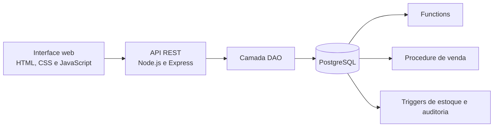

# Sistema de E-commerce com PostgreSQL

Este projeto é um painel administrativo de e-commerce desenvolvido para demonstrar, de forma prática, a integração entre uma aplicação web e um banco de dados relacional.

Pela interface, o usuário consegue cadastrar clientes, categorias e produtos, controlar pedidos e consultar relatórios. Por trás das telas, o PostgreSQL assume responsabilidades importantes, como validar vendas, calcular totais, atualizar o estoque automaticamente e registrar um histórico de suas alterações.

O resultado é um sistema pequeno o suficiente para ser compreendido em sala de aula, mas com conceitos que também aparecem em aplicações reais.

## Funcionalidades

- CRUD completo de clientes, com suporte a pessoa física e pessoa jurídica;
- CRUD completo de categorias;
- CRUD completo de produtos;
- controle automático de disponibilidade conforme o estoque;
- criação, consulta, atualização e exclusão de pedidos;
- validação de produtos e estoque antes da venda;
- cálculo de totais e descontos;
- relatórios de pedidos, vendas por cliente e movimentações de estoque;
- auditoria automática das alterações de estoque;
- API REST integrada à interface web.

## Como o sistema funciona



A interface envia requisições HTTP para a API. As rotas encaminham as operações para os arquivos DAO, responsáveis pela comunicação com o PostgreSQL.

As regras mais sensíveis não dependem somente da aplicação:

- a **Procedure** `sp_realizar_venda` valida e registra uma venda completa;
- as **Functions** calculam totais e produzem os dados dos relatórios;
- os **Triggers** atualizam o estoque, sincronizam a disponibilidade dos produtos e gravam a auditoria;
- as **transações** utilizam `COMMIT` e `ROLLBACK` para evitar pedidos parcialmente cadastrados.

Se uma venda solicitar uma quantidade maior que o estoque disponível, por exemplo, o banco cancela a operação e mantém os dados consistentes.

## Tecnologias utilizadas

- Node.js;
- Express;
- PostgreSQL;
- biblioteca `pg` para acesso ao banco;
- JavaScript;
- HTML5;
- CSS3;
- SQL e PL/pgSQL.

## Estrutura principal

```text
Banco-de-dados/
├── implementacao/
│   ├── database.sql
│   └── ecommerce-api/
│       ├── dao/
│       ├── frontend/
│       ├── sql/
│       ├── db.js
│       ├── server.js
│       └── package.json
├── Documentação/
└── Estudos e guia de demonstração/
```

- `implementacao/database.sql`: cria as tabelas e rotinas do banco;
- `implementacao/ecommerce-api/server.js`: define as rotas e inicia o servidor;
- `implementacao/ecommerce-api/dao/`: contém o acesso aos dados;
- `implementacao/ecommerce-api/frontend/`: contém a interface do sistema;
- `implementacao/ecommerce-api/sql/`: contém as Functions, Triggers e a Procedure;
- `Documentação/`: reúne os materiais de modelagem do banco.

## Pré-requisitos

Antes de executar o projeto, tenha instalado:

- [Node.js](https://nodejs.org/) 18 ou superior;
- [PostgreSQL](https://www.postgresql.org/);
- Git, caso queira clonar o repositório.

## Instalação

### 1. Clone o repositório

```bash
git clone https://github.com/EdelsonJr11/Banco-de-dados.git
cd Banco-de-dados
```

### 2. Crie o banco de dados

Crie um banco chamado `ecommerce` pelo pgAdmin ou pelo terminal:

```bash
createdb -U postgres ecommerce
```

Depois execute o arquivo `implementacao/database.sql` nesse banco.

Pelo terminal:

```bash
psql -U postgres -d ecommerce -f implementacao/database.sql
```

No pgAdmin, abra o **Query Tool** conectado ao banco `ecommerce`, carregue o arquivo `database.sql` e execute o script.

> O script completo deve ser executado em um banco novo, pois ele cria todas as tabelas necessárias.

### 3. Configure a conexão

Confira as credenciais em `implementacao/ecommerce-api/db.js`:

```js
const pool = new Pool({
    user: 'postgres',
    host: 'localhost',
    database: 'ecommerce',
    password: 'postgres',
    port: 5432,
});
```

Altere usuário, senha ou porta de acordo com a instalação local do PostgreSQL.

### 4. Instale as dependências

```bash
cd implementacao/ecommerce-api
npm install
```

### 5. Inicie o sistema

```bash
npm start
```

Abra no navegador:

```text
http://localhost:3000
```

Para executar em modo de desenvolvimento, com reinicialização automática:

```bash
npm run dev
```

## Verificação da conexão

Com o servidor em execução, acesse:

```text
http://localhost:3000/status
```

Quando a aplicação estiver conectada corretamente, a rota retornará uma resposta semelhante a:

```json
{
  "mensagem": "API conectada ao PostgreSQL",
  "clientes": 4,
  "produtos": 6,
  "categorias": 7,
  "pedidos": 6
}
```

As quantidades variam conforme os dados cadastrados no banco.

## Rotas da API

| Método | Rota | Finalidade |
|---|---|---|
| `GET` | `/clientes` | Lista os clientes |
| `POST` | `/clientes` | Cadastra um cliente |
| `GET` | `/clientes/:id` | Consulta um cliente |
| `PUT` | `/clientes/:id` | Atualiza um cliente |
| `DELETE` | `/clientes/:id` | Exclui um cliente |
| `GET/POST` | `/categorias` | Lista ou cadastra categorias |
| `GET/PUT/DELETE` | `/categorias/:id` | Consulta, atualiza ou exclui uma categoria |
| `GET/POST` | `/produtos` | Lista ou cadastra produtos |
| `GET/PUT/DELETE` | `/produtos/:id` | Consulta, atualiza ou exclui um produto |
| `GET/POST` | `/pedidos` | Lista ou cadastra pedidos |
| `GET/PUT/DELETE` | `/pedidos/:id` | Consulta, atualiza ou exclui um pedido |
| `GET` | `/pedidos-com-cliente` | Lista pedidos com dados do cliente |
| `GET` | `/relatorio-vendas` | Exibe as vendas agrupadas por cliente |
| `GET` | `/relatorio-estoque` | Exibe o estoque e suas movimentações |
| `GET` | `/status` | Verifica a aplicação e a conexão com o banco |

Nas rotas com `:id`, o identificador deve ser acrescentado ao endereço, como em `/produtos/1`.

## Recursos de banco de dados

### Procedure

`sp_realizar_venda` recebe o cliente, os itens e a previsão de entrega. Ela valida os dados, bloqueia os produtos durante a operação com `FOR UPDATE`, registra o pedido e confirma a transação somente quando todas as etapas terminam corretamente.

### Functions

- `fn_calcular_total_item`: calcula quantidade, preço e desconto;
- `fn_calcular_total_pedido`: calcula o valor completo de um pedido;
- `fn_listar_pedidos`: devolve os pedidos em um formato pronto para a aplicação;
- `fn_relatorio_vendas_por_cliente`: agrupa as vendas por cliente;
- `fn_relatorio_estoque`: apresenta o estoque e seu histórico de movimentações.

### Triggers

- `trg_produto_sincronizar_disponibilidade`: mantém a disponibilidade coerente com o estoque;
- `trg_item_pedido_controlar_estoque`: baixa ou devolve itens ao estoque quando um pedido é alterado;
- `trg_produto_auditar_estoque`: registra cada mudança na tabela de auditoria.

## Natureza do projeto

Este é um projeto acadêmico voltado ao estudo de Banco de Dados, modelagem relacional, SQL, PL/pgSQL, APIs REST e integração entre front-end, back-end e PostgreSQL.

O sistema está funcional para execução e demonstração local. Antes de utilizá-lo em produção, ainda seria recomendável proteger as credenciais com variáveis de ambiente, adicionar autenticação, testes automatizados, logs estruturados e configurações de segurança para implantação.
